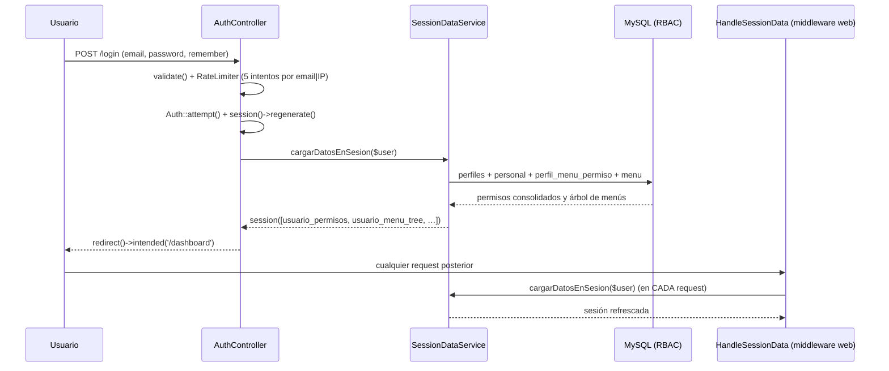
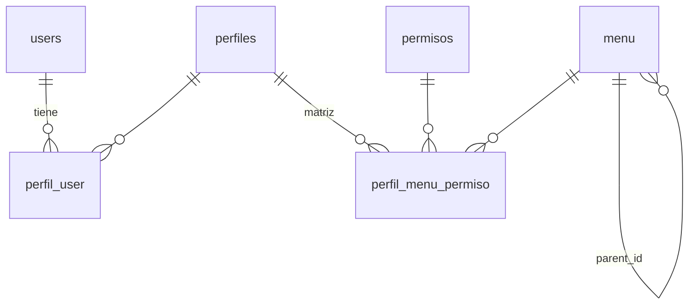
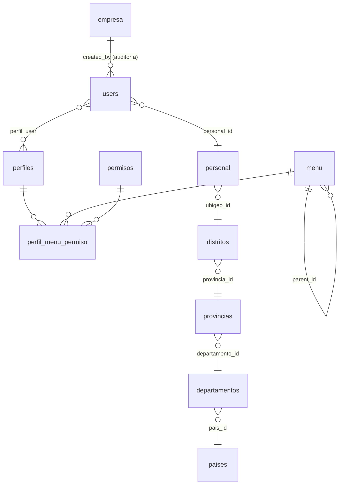

# Análisis de Arquitectura Reutilizable — **FlowStock** como kit de inicio de Clínica UroCenter

> **Fecha:** 2026-09-12
> **Alcance:** Arquitectura técnica de `c:\laragon\www\FlowStock` (Laravel 12 + Blade) y decisión de qué se reutiliza como **kit de inicio** para Clínica UroCenter.
> **Documento relacionado:** `../Arquitectura del Sistema Web Clínica UroCenter.md` (doc 01) — módulos objetivo, stack y restricción "sin Livewire".
> **Documento complementario:** `analisis-template-dreamsemr.md` — plantilla visual adoptada.
> **Ojo:** este documento **no repite** el análisis funcional ya existente en `c:\laragon\www\FlowStock\docs\2026-09-01-analisis-base-flowstock.md`; aquí se documenta **arquitectura, contratos y decisiones reutilizables**.

---

## Índice

1. [Resumen ejecutivo: qué se reutiliza](#1-resumen-ejecutivo-qué-se-reutiliza)
2. [Stack tecnológico y decisiones](#2-stack-tecnológico-y-decisiones)
3. [Estructura de carpetas a replicar](#3-estructura-de-carpetas-a-replicar)
4. [Controladores: contrato CRUD](#4-controladores-contrato-crud)
5. [Form Requests](#5-form-requests)
6. [Modelos](#6-modelos)
7. [Rutas](#7-rutas)
8. [Breadcrumbs](#8-breadcrumbs)
9. [Sesión y datos del usuario](#9-sesión-y-datos-del-usuario)
10. [Control de acceso RBAC](#10-control-de-acceso-rbac)
11. [Migraciones](#11-migraciones)
12. [Tablas maestras iniciales](#12-tablas-maestras-iniciales)
13. [Seeders](#13-seeders)
14. [Patrón de frontend (Blade + AJAX)](#14-patrón-de-frontend-blade--ajax)
15. [Kit de inicio propuesto (preludio de la instalación)](#15-kit-de-inicio-propuesto-preludio-de-la-instalación)
16. [Deuda técnica a NO heredar](#16-deuda-técnica-a-no-heredar)
17. [Checklist de verificación del kit](#17-checklist-de-verificación-del-kit)
- [Anexo A. Mapa de archivos clave](#anexo-a-mapa-de-archivos-clave)
- [Anexo B. Convenciones resumidas](#anexo-b-convenciones-resumidas)

---

## 1. Resumen ejecutivo: qué se reutiliza

FlowStock es un ERP-ligero en **Laravel 12 + Blade puro + AJAX** cuya **base técnica** (no su negocio) es exactamente lo que UroCenter necesita: autenticación endurecida, RBAC dinámico por base de datos, menú dinámico jerárquico, breadcrumbs, patrón CRUD uniforme y maestras de arranque.

| Elemento de FlowStock | Decisión | Motivo |
|---|---|---|
| Autenticación custom (`AuthController`) | **Reutilizar** | Sin Livewire, con rate limiting y protección de session fixation |
| RBAC (4 tablas + helper + directiva Blade) | **Reutilizar y adaptar** | Cubre "Usuarios / Roles / Permisos / Menús" del doc 01 §32–§36 |
| Menú dinámico multinivel desde BD | **Reutilizar** | Alimenta el sidebar de Dreams EMR |
| Sesión de datos (`SessionDataService` + middleware) | **Reutilizar con mejora** | Permisos efectivos sin logout; ver §16 D14 |
| Patrón CRUD de controladores (`index/getData/store/edit/update/toggle`) | **Reutilizar** | Contrato uniforme para todo el sistema |
| Form Requests por módulo | **Reutilizar** | Validación + `422` automático |
| Migraciones por carpeta de dominio + `loadMigrationsFrom` | **Reutilizar (con corrección)** | Ver §16 D1: falta registrar `perfiles/` |
| Maestras: `empresa`, `parametros`, `terminal`, `menu`, `personal`, `paises/departamentos/provincias/distritos` | **Reutilizar y ampliar** | Arranque inmediato del sistema |
| Breadcrumbs Diglactic | **Reutilizar** | Mapa de navegación y título de página |
| Tema *Silvar* y su CSS/JS | **Descartar** | Se usa **Dreams EMR** como plantilla visual (doc 01 §5) |
| Módulos de negocio (compras, almacén, ventas, POS, caja) | **Descartar** | No existen (carpetas vacías) y el negocio es distinto |
| Vite + Tailwind 4 | **Descartar Tailwind**, conservar Vite | FlowStock no usa Tailwind en sus vistas |

---

## 2. Stack tecnológico y decisiones

### 2.1 Stack de FlowStock (verificado)

| Ítem | Valor |
|---|---|
| Framework | `laravel/framework ^12.0` |
| PHP | `^8.2` |
| Base de datos | MySQL (`db_flowstock`) |
| Frontend | Blade + Bootstrap 5 + JS nativo (`fetch`) |
| Tema | *Silvar* v3.1.0 copiado a `public/assets/` |
| Sesión | `SESSION_DRIVER=database` |
| Caché | `CACHE_STORE=database` |
| Colas | `QUEUE_CONNECTION=database` |
| Locale | `APP_LOCALE=es`, `APP_FALLBACK_LOCALE=es`, `APP_FAKER_LOCALE=es_PE` |
| `APP_URL` | `http://flowstock.test` |
| Storage | `storage/app/public` → `public/storage` (logos) |

### 2.2 Dependencias Composer

**Producción**

| Paquete | Versión | Para qué |
|---|---|---|
| `laravel/framework` | `^12.0` | Framework |
| `laravel/tinker` | `^2.10.1` | Consola interactiva |
| `diglactic/laravel-breadcrumbs` | `^10.0` | **Breadcrumbs** |

**Desarrollo**

`fakerphp/faker ^1.23`, `laravel-lang/common ^6.8` (traducciones `es`), `laravel/pail ^1.2.2` (logs en vivo), `laravel/pint ^1.24` (formateo), `laravel/sail ^1.41`, `mockery/mockery ^1.6`, `nunomaduro/collision ^8.6`, `phpunit/phpunit ^11.5.50`.

> **Nota:** FlowStock **no usa** Breeze, Jetstream, Livewire, Inertia, Spatie Permission ni Laravel Permission. **Todo el RBAC es propio.**

### 2.3 Dependencias NPM

`vite ^7.0.7`, `laravel-vite-plugin ^2.0.0`, `axios ^1.11.0`, `concurrently ^9.0.1`, `tailwindcss ^4.0.0`, `@tailwindcss/vite ^4.0.0`.

`vite.config.js` declara como entrada `resources/css/app.css` y `resources/js/app.js` y activa Tailwind — **pero las vistas no lo usan** (el CSS real viene del tema en `public/assets/`).

### 2.4 Scripts de `composer.json`

| Script | Composición |
|---|---|
| `setup` | `composer install` → crea `.env` → `artisan key:generate` → `artisan migrate --force` → `npm install` → `npm run build` |
| `dev` | `npx concurrently`: `php artisan serve` + `queue:listen` + `pail` + `npm run dev` |
| `test` | `artisan config:clear` → `artisan test` |

### 2.5 Decisiones para UroCenter

| Decisión | Valor |
|---|---|
| Starter kit | **Ninguno**. Se replica el auth custom de FlowStock |
| Framework | Laravel 12 |
| Vistas | Blade + Bootstrap 5 + JS nativo (sin jQuery, sin Livewire, sin Inertia) |
| Tema | Dreams EMR copiado a `public/assets/` |
| Tailwind | **No se adopta** (el tema ya trae su CSS) |
| Vite | Se mantiene **solo** para CSS/JS propios del proyecto |
| Paquetes a instalar | `diglactic/laravel-breadcrumbs`, `laravel-lang/common` (dev) + los dev que se quieran conservar |
| BD | MySQL 8, `db_clinicaurocenter` |

---

## 3. Estructura de carpetas a replicar

Conteos reales de FlowStock: **14** archivos de controlador, **11** Form Requests, **12** modelos, **15** migraciones, **22** vistas Blade, **40** librerías de assets.

```text
app/
├── Helpers/
│   └── PermisoHelper.php                 ← autorización central: puede($enlace, $accion)
├── Services/
│   └── SessionDataService.php            ← carga de perfiles/permisos/menú en sesión
├── Http/
│   ├── Controllers/
│   │   ├── Controller.php                (base, vacío)
│   │   ├── AuthController.php            ← login / register / logout + throttle
│   │   └── Configuracion/                ← 11 CRUDs + PerfilController (RBAC)
│   ├── Middleware/
│   │   └── HandleSessionData.php         ← refresca la sesión RBAC en cada request
│   └── Requests/
│       └── Configuracion/                ← 11 Form Requests (uno por CRUD)
├── Models/
│   ├── User.php                          ← tienePermiso(), permisosPorMenu()
│   └── Configuracion/                    ← 11 modelos
└── Providers/
    └── AppServiceProvider.php            ← loadMigrationsFrom() + directiva @can_do

bootstrap/
└── app.php                               ← HandleSessionData añadido a web

database/
├── migrations/
│   ├── 0001_01_01_000{000,001,002}_*.php users / cache / jobs
│   ├── 2026_03_20_010143_add_personal_and_perfil_to_users_table.php
│   ├── 2026_03_23_062958_add_acceso_permission.php
│   ├── configuracion/   (6)
│   ├── parametros/      (1)
│   ├── menu/            (1)
│   ├── terminal/        (1)
│   └── perfiles/        (1)  ← NO registrada en AppServiceProvider (ver §16 D1)
└── seeders/
    ├── DatabaseSeeder.php                ← permisos → perfil admin → personal → usuario → menú → asignación masiva
    ├── MenuSeeder.php                    ← árbol de menús (3 niveles)
    └── UbigeoPeruSeeder.php              ← departamentos / provincias / distritos desde JSON

resources/views/
├── layouts/
│   ├── app.blade.php                     ← layout autenticado
│   └── guest.blade.php                   ← layout de autenticación
├── components/layouts/
│   ├── sidebar.blade.php                 ← menú dinámico 3 niveles
│   ├── topbar.blade.php
│   ├── footer.blade.php
│   └── configuracion/<modulo>/index.blade.php   ← 11 vistas CRUD + permisos.blade.php
├── auth/{login,register}.blade.php
└── dashboard.blade.php

routes/
├── web.php                               ← todas las rutas
├── breadcrumbs.php                       ← Diglactic
└── console.php
```

### 3.1 Estructura objetivo para UroCenter (propuesta)

```text
app/
├── Helpers/PermisoHelper.php
├── Services/{SessionDataService.php, ParametroService.php, SerieService.php, …}
├── Http/
│   ├── Controllers/{AuthController.php}
│   ├── Controllers/Admin/{UsuarioController, PerfilController, PermisoController, MenuController}
│   ├── Controllers/Configuracion/{EmpresaController, SucursalController, ParametroController, TerminalController, …}
│   ├── Controllers/Clinico/{PacienteController, CitaController, AtencionController, …}
│   ├── Controllers/Comercial/{VentaController, CajaController, …}
│   ├── Controllers/Farmacia/…
│   ├── Controllers/Reporte/…
│   ├── Middleware/HandleSessionData.php
│   └── Requests/<mismo dominio>/…
├── Models/<dominio>/…
└── Providers/AppServiceProvider.php

database/migrations/
├── admin/         menu, perfiles, permisos, perfil_user, perfil_menu_permiso
├── configuracion/ empresa, sucursal, parametros, terminal, ubigeo, personal
├── clinico/       pacientes, citas, atenciones, …
├── comercial/     series, ventas, caja, …
└── farmacia/      …
```

> **Regla:** cada carpeta nueva de migraciones **debe** registrarse en `AppServiceProvider::boot()` con `loadMigrationsFrom()`. El fallo de FlowStock con `perfiles/` (§16 D1) demuestra lo que pasa cuando se olvida.

---

## 4. Controladores: contrato CRUD

### 4.1 Contrato uniforme

Todos los CRUD de FlowStock exponen exactamente los mismos 6 métodos:

| Método | Ruta | Verbo | Respuesta | Comportamiento |
|---|---|---|---|---|
| `index` | `/<dominio>/<modulo>` | GET | `view()` | Devuelve la vista Blade (tabla + modales) |
| `getData` | `/<dominio>/<modulo>/data` | GET | JSON `{data, can}` | Datos para la tabla + permisos del usuario sobre el módulo |
| `store` | `/<dominio>/<modulo>` | POST | JSON `{success, message, data}` | Crea en transacción, setea `created_by` |
| `edit` | `/<dominio>/<modulo>/{id}/edit` | GET | JSON `{success, data}` | Datos para el modal de edición |
| `update` | `/<dominio>/<modulo>/{id}` | POST | JSON `{success, message}` | Actualiza, setea `updated_by` |
| `toggle` | `/<dominio>/<modulo>/{id}/toggle` | POST | JSON `{success, message}` | Activa/desactiva (`estado`), permiso `activar`/`desactivar` |
| `show` | `/<dominio>/<modulo>/{id}` | GET | JSON `{success, data, permisos}` | Detalle en JSON. Existe en **7** controladores: `Perfil` (con permisos agrupados) y `Pais`, `Departamento`, `Provincia`, `Distrito`, `Personal`, `Usuario` — en estos últimos la ruta `toggle` apunta erróneamente aquí (§4.3) |

### 4.2 Reglas obligatorias por método

1. **Autorización primero** en cada acción de escritura:

   ```text
   if (! PermisoHelper::puede('configuracion.empresa.index', 'crear')) {
       return response()->json(['success' => false, 'message' => 'No tienes permiso…'], 403);
   }
   ```

2. **Transacciones**: `DB::beginTransaction()` / `DB::commit()` / `DB::rollBack()` en `store` y `update` cuando tocan más de una tabla.
3. **Auditoría**: `created_by = auth()->id()` en `store`, `updated_by = auth()->id()` en `update` y `toggle`.
4. **Códigos HTTP**: `403` sin permiso, `422` validación (automático vía Form Request), `500` excepción con `'Error: '.$e->getMessage()`.
5. **Carga optimizada**: `with('creator:id,name')` para no exponer todo el usuario.
6. **Archivos**: `$request->file('logo_file')->store('empresas', 'public')` + borrado del anterior con `Storage::disk('public')->delete(...)`.
7. **`getData` devuelve `can`**: `auth()->user()->permisosPorMenu('<ruta>')` para que la vista oculte/muestre acciones por fila.

### 4.3 Diferencias entre controladores (a unificar en UroCenter)

| Rasgo | Controladores "completos" (`Empresa`, `Parametros`, `Terminal`, `Menu`, `Perfil`, `Permiso`) | Controladores "incompletos" (`Pais`, `Departamento`, `Provincia`, `Distrito`, `Personal`, `Usuario`) |
|---|---|---|
| `update` | Método `update()` | Ruta apunta a `store()` ⚠️ |
| `toggle` | Método `toggle()` | Ruta apunta a `show()` ⚠️ (y **no existe** el método `toggle()`) |
| `show` | Solo `Perfil`, con permisos agrupados | Existe `show()` pero sin verificación de permisos; es el destino de la ruta `toggle` |
| Validación | Form Request (`XRequest`) | `PersonalController` y `PermisoController` validan con `Illuminate\Http\Request` inline |

> **Acción en UroCenter:** escribir el contrato **una sola vez** y respetarlo en todos los módulos. No clonar los controladores "incompletos".

### 4.4 Ejemplo de referencia

`app/Http/Controllers/Configuracion/EmpresaController.php` es el patrón canónico: `index` → `view('components.layouts.configuracion.empresa.index')`, `getData` con `can`, `store` con transacción + logo, `edit` con permiso `editar`, `update` con borrado de archivo previo, `toggle` con permiso dinámico `activar`/`desactivar`.

`PerfilController` añade el flujo RBAC:

- `index()` carga los menús raíz con `Menu::with('children.children')` para el árbol de checkboxes.
- `show($id)` devuelve el perfil **y** `permisos` agrupados `[menu_id => ['nombre','nivel','acciones[]']]`.
- `gestionPermisos($id)` renderiza la matriz (`components.layouts.configuracion.perfil.permisos`).
- `guardarPermisos($perfilId)` (POST `…/perfil/{perfilId}/permisos/save`) persiste la matriz en `perfil_menu_permiso`.

---

## 5. Form Requests

Ubicación: `app/Http/Requests/<Dominio>/<Entidad>Request.php` (11 archivos en FlowStock).

| Aspecto | Implementación verificada |
|---|---|
| `authorize()` | `return true;` — la autenticación la resuelve el middleware `auth`, y la autorización fina la hace `PermisoHelper` en el controlador |
| Regla de unicidad | `Rule::unique('empresa', 'ruc')->ignore($id)` con `$id = $this->input('id')` |
| Campos opcionales | `'nullable'` |
| Archivos | `'nullable','image','mimes:jpeg,png,jpg,svg','max:2048'` |
| Respuesta de error | `422` JSON automático, consumido por el JS de la vista con `.invalid-feedback` |

**Uso real verificado:** 11 Form Requests existen, pero se usan en 10 controladores. `PermisoController` y `PersonalController` validan con `Illuminate\Http\Request` inline, por lo que `PersonalRequest` **existe pero no se usa** (código muerto). Además, `PaisController`, `DepartamentoController`, `ProvinciaController`, `DistritoController` y `UsuarioController` solo lo usan en `store()`, no en `update()`.

### 5.1 Mejora propuesta

- Separar reglas `store` vs `update` usando `$this->routeIs(...)` o crear `StoreXRequest`/`UpdateXRequest` cuando las reglas difieran.
- Mover a `prepareForValidation()` la normalización (trim, mayúsculas, fechas `d/m/Y` → `Y-m-d`), muy común en formularios peruanos (RUC/DNI, teléfonos).

---

## 6. Modelos

### 6.1 `User` (`app/Models/User.php`)

| Aspecto | Detalle |
|---|---|
| `$fillable` | `name`, `email`, `password`, `personal_id`, `perfil_id`, `estado` |
| Casts | `email_verified_at => datetime`, `password => hashed` |
| Relación 1:1 | `personal()` → `belongsTo(Personal::class)` |
| Relación M:M | `perfiles()` → `belongsToMany(Perfil::class, 'perfil_user', 'user_id', 'perfil_id')->withTimestamps()` |
| Permisos | `tienePermiso($menuIduEnlace, $codigoAccion = 'ver'): bool` — acepta **id de menú o nombre de ruta**; devuelve `false` si `estado` es falso |
| Permisos | `permisosPorMenu($enlace): array` → `['ver' => true, 'crear' => true, …]`; bypass total si `id === 1` o `perfil_id == 1` |

### 6.2 Modelos de dominio (`app/Models/Configuracion/`)

| Modelo | Detalle relevante |
|---|---|
| `Menu` | `protected $table = 'menu'`; `$casts = ['estado' => 'boolean']`; relaciones `parent()`, `children()` (`hasMany` ordenado por `orden`), `creator()`, `updater()` |
| `Perfil` | `protected $table = 'perfiles'`; relación con `creator` |
| `Permiso` | Catálogo de acciones (`codigo`, `nombre`, `estado`) |
| `Empresa`, `Parametros`, `Terminal`, `Personal`, `Pais`, `Departamento`, `Provincia`, `Distrito` | `$fillable` de sus columnas + `creator()`/`updater()` |

### 6.3 Convenciones a replicar

1. Un modelo por entidad; `$table` explícito porque las tablas van en **singular**.
2. `$casts(['estado' => 'boolean'])` en toda entidad con `estado`.
3. Relaciones de auditoría `creator()` / `updater()` en **todos** los modelos con `created_by`/`updated_by`.
4. Subnamespace por dominio (`Configuracion`, y en UroCenter: `Admin`, `Clinico`, `Comercial`, `Farmacia`).
5. Los métodos de autorización viven en `User`, no dispersos en controladores.

---

## 7. Rutas

### 7.1 Estructura de `routes/web.php`

```text
Route::middleware('guest')->group()
├── GET  /                  → redirect a login
├── GET  /login             name: login
├── POST /login
├── GET  /register          name: register
└── POST /register

Route::middleware('auth')->group()
├── GET  /dashboard         name: dashboard      (closure que retorna view('dashboard'))
├── POST /logout            name: logout
└── Route::prefix('configuracion')->name('configuracion.')->group()
    └── Route::controller(XController::class)->group()
        ├── GET  /empresa               name: empresa.index
        ├── GET  /empresa/data          name: empresa.data
        ├── POST /empresa               name: empresa.store
        ├── GET  /empresa/{id}/edit     name: empresa.edit
        ├── POST /empresa/{id}          name: empresa.update
        └── POST /empresa/{id}/toggle   name: empresa.toggle
```

### 7.2 Convención de nombres

| Patrón | Ejemplo |
|---|---|
| `<dominio>.<modulo>.<accion>` | `configuracion.empresa.index` |
| Acciones: `index`, `data`, `store`, `edit`, `update`, `toggle`, `show` | — |
| Rutas RBAC especiales | `configuracion.perfil.permisos`, `configuracion.perfil.permisos.save` |

> **Importante:** el **nombre de la ruta** (`enlace`) es la **clave de autorización** en `menu.enlace` y en `PermisoHelper::puede()`. Cambiar un nombre de ruta rompe el RBAC y los breadcrumbs simultáneamente.

### 7.3 Propuesta para UroCenter

| Aspecto | Propuesta |
|---|---|
| Agrupación | Por dominio: `admin`, `configuracion`, `clinico`, `comercial`, `farmacia`, `reportes` |
| Controladores | `Route::controller(...)->group()` con los 6 métodos estándar |
| `Route::resource` | **No usar**: el contrato AJAX (`data`, `toggle`, respuestas JSON) es incompatible con los nombres/métodos de `resource` |
| Orden de archivos | Mientras `web.php` no supere ~150 líneas, mantenerlo único; luego separar en `routes/admin.php`, `routes/clinico.php`, etc., registrados desde `bootstrap/app.php` con `->withRouting(then: …)` |
| Middleware extra | Añadir `auth` en el grupo padre; evaluar un middleware `permission:<enlace>,<accion>` para no repetir `PermisoHelper` en cada método |

---

## 8. Breadcrumbs

Paquete: **`diglactic/laravel-breadcrumbs ^10.0`**. Archivo: `routes/breadcrumbs.php`.

```text
Breadcrumbs::for('configuracion', function (BreadcrumbTrail $trail) {
    $trail->push('Configuración');                      // nodo padre, sin URL
});

Breadcrumbs::for('configuracion.empresa.index', function (BreadcrumbTrail $trail) {
    $trail->parent('configuracion');                    // enlaza al padre
    $trail->push('Empresa', route('configuracion.empresa.index'));
});
```

Consumo en la vista:

```text
@section('page-title', 'Mantenimiento de Empresas')
@section('page-subtitle', 'Administra el catálogo principal de empresas del sistema')
@section('breadcrumb')
    {{ Breadcrumbs::render('configuracion.empresa.index') }}
@endsection
```

Y en el layout, la sección se dibuja solo si existe:

```text
@hasSection('breadcrumb')
    … <h4>@yield('page-title')</h4> <p>@yield('page-subtitle')</p> @yield('breadcrumb') …
@endif
```

### 8.1 Reglas a replicar

1. **Un módulo nuevo ⇒ una breadcrumb registrada**, con el mismo nombre que la ruta.
2. Los nodos padre sin URL se registran una vez (ej. `configuracion`) y se reutilizan con `$trail->parent()`.
3. Los breadcrumbs con parámetros (ej. `configuracion.perfil.permisos`) reciben el argumento: `function (BreadcrumbTrail $trail, $id)`.
4. Traducir los textos a español clínico (`Pacientes`, `Admisión`, `Consulta Externa`, …).

---

## 9. Sesión y datos del usuario

### 9.1 Flujo completo



### 9.2 Claves de sesión (contrato exacto)

| Clave | Tipo | Contenido |
|---|---|---|
| `usuario_perfiles_ids` | array | IDs de todos los perfiles del usuario |
| `usuario_perfil_nombre` | string | Nombres unidos por coma, o `'Sin Perfil'` |
| `usuario_permisos` | array | `[menu_id => [codigo_accion => '1']]` consolidado de todos los perfiles |
| `usuario_personal_id` | int | ID del registro en `personal` |
| `usuario_personal_nombres` / `_apellidos` / `_ndoc` | string | Datos del personal |
| `usuario_display_name` | string | `nombres . ' ' . apellidos`, o `name` si no hay personal |
| `usuario_menu_tree` | array | Árbol de menús accesibles: `[id, nivel, nombre, icono, enlace, bloque, parent_id, hijos[]]` |

### 9.3 `SessionDataService`

| Método | Comportamiento |
|---|---|
| `cargarDatosEnSesion(User $user)` | `$user->load(['personal','perfiles'])` → consolida permisos → guarda claves → construye el árbol de menús. Todo dentro de `try/catch` con `Log::error` |
| `obtenerPermisosConsolidados(User $user)` | Query a `perfil_menu_permiso` ⋈ `permisos` (con `permisos.estado = true`) filtrando por los perfiles del usuario → `[menu_id][codigo] = '1'` |
| `construirMenuAccesible(array $permisos)` | Trae `Menu::where('estado', true)` ordenado por `nivel`, `bloque`, `orden`; incluye solo nodos con permiso **`acceso`** y sus ancestros con hijos accesibles |
| `tieneHijosAccesibles(...)` | Recursivo: determina si un nodo tiene descendientes accesibles |

### 9.4 Middleware `HandleSessionData`

- Se inyecta `SessionDataService` por constructor.
- En `handle()`: si `Auth::check()`, llama a `cargarDatosEnSesion(Auth::user())` y continúa.
- Registrado en `bootstrap/app.php`:

  ```text
  ->withMiddleware(function (Middleware $middleware) {
      $middleware->web(append: [\App\Http\Middleware\HandleSessionData::class]);
  })
  ```

- **Efecto:** los cambios de permisos/perfiles aplican en el siguiente request, **sin cerrar sesión**. Es el mecanismo que hace que el RBAC sea realmente dinámico.

### 9.5 Coste y mejora propuesta

Recargar la sesión en **cada** request implica ~4–5 consultas por petición (perfiles, personal, consolidado, menús). Para UroCenter:

| Opción | Descripción |
|---|---|
| **A (recomendada)** | Mantener el comportamiento, pero invalidar/refrescar **solo cuando cambie algo**: guardar en sesión un `rbac_version` y refrescar si `Cache::get('rbac_version')` difiere; incrementar esa clave al guardar permisos, perfiles, usuarios o menús |
| B | Cargar la sesión solo en login y en un endpoint explícito "recargar permisos" |
| C | Cachear el árbol de menús por perfil (`Cache::remember("menu_tree_perfil_{$perfilId}")`) |

---

## 10. Control de acceso RBAC

### 10.1 Modelo conceptual



```text
USUARIO ──(M:M)── PERFILES ──(matriz perfil × menú × permiso)── MENÚ + ACCIÓN
```

### 10.2 Tablas

| Tabla | Columnas | Notas |
|---|---|---|
| `permisos` | `id`, `codigo` (50, único), `nombre` (100), `descripcion` (250, null), `estado` (bool), `created_by`, `updated_by`, timestamps | Catálogo **dinámico** de acciones |
| `perfiles` | `id`, `nombre` (100), `descripcion` (250, null), `permisos` (**json**, legado), `estado`, auditoría, timestamps | El campo `permisos` json ya **no se usa** |
| `perfil_user` | `id`, `user_id` (FK cascade), `perfil_id` (FK cascade), auditoría, timestamps | Pivote M:M |
| `perfil_menu_permiso` | `id`, `perfil_id`, `menu_id`, `permiso_id` (FK cascade), auditoría, timestamps, `unique(perfil_id, menu_id, permiso_id)` **`peril_menu_permiso_unique`** | **El corazón del RBAC** |
| `menu` | `id`, `bloque` (50, null), `nivel` (100), `nombre` (100), `enlace` (150, null), `icono` (100, null), `parent_id` (FK self, cascade), `orden` (int), `estado`, auditoría, timestamps; índices `parent_id`, `orden`, `bloque`, `nivel` | Soporta 3+ niveles |

### 10.3 Catálogo de acciones

Del `DatabaseSeeder`: `ver`, `crear`, `editar`, `eliminar`, `activar`, `desactivar`, `aprobar`, `exportar`.
Añadida por migración: **`acceso`** (id 10) — *"Permite que el menú sea visible en la barra lateral"*.

> El permiso `acceso` es el que decide la **visibilidad del menú**; los demás deciden las **acciones** dentro del módulo.

### 10.4 Jerarquía del campo `nivel`

Ejemplo real del `MenuSeeder` (código jerárquico por concatenación, no es numérico):

| `nivel` | Significado | Ejemplo |
|---|---|---|
| `01` | Bloque raíz con enlace propio | Dashboard |
| `02` | Bloque raíz con hijos | Configuración |
| `0201` | Hijo de `02` | Empresa |
| `020101` | Nieto (3er nivel, ya soportado por el sidebar) | — |

### 10.5 Las 4 capas de aplicación del RBAC

| Capa | Mecanismo | Archivo |
|---|---|---|
| 1. Servidor (acción) | `PermisoHelper::puede($enlace, $accion)` → **403 JSON** | `app/Helpers/PermisoHelper.php` |
| 2. Consulta (datos) | `getData` devuelve `can` = `User::permisosPorMenu($enlace)` | cada controlador |
| 3. Vista (UI) | Directiva Blade `@can_do('ruta','accion')` … `@endcan_do` | `AppServiceProvider::boot()` |
| 4. Navegación (menú) | `usuario_menu_tree` (solo nodos con permiso `acceso`) | `SessionDataService` + `sidebar.blade.php` |

`PermisoHelper`:

```text
$user = Auth::user();
if (!$user) return false;
if ($user->id === 1 || $user->perfil_id == 1) return true;   // superadmin hardcodeado
return $user->tienePermiso($enlace, $accion);
```

### 10.6 UI de gestión de permisos

- `PerfilController::index()` → vista con listado de perfiles.
- `PerfilController::gestionPermisos($id)` → **matriz** perfil × menú × acción (`components/layouts/configuracion/perfil/permisos.blade.php`).
- `PerfilController::guardarPermisos($perfilId)` → POST `configuracion.perfil.permisos.save` → persiste en `perfil_menu_permiso`.
- `PerfilController::show($id)` → devuelve los permisos agrupados por menú (para el modal de detalle).

### 10.7 Mejoras propuestas para UroCenter

| # | Problema en FlowStock | Mejora |
|---|---|---|
| M1 | Superadmin detectado por `id === 1` o `perfil_id == 1` (hardcode) | Marcar el perfil con un campo `es_superadmin` (bool) o `codigo` único (`SUPERADMIN`) |
| M2 | Permisos base insertados con IDs implícitos (1–8) y `acceso` con `id => 10` hardcodeado | Sembrar por `codigo` (como ya hace `updateOrCreate`) y **nunca** referenciar IDs numéricos |
| M3 | `perfil_user` y `users.perfil_id` conviven | Eliminar `users.perfil_id` en UroCenter (o dejarlo solo como "perfil principal" con regla explícita) |
| M4 | Al autorizar se hace 1 `exists()` por comprobación | Cachear permisos por usuario/request; usar `Gate::before` para el superadmin |
| M5 | Acciones fijas | Añadir acciones clínicas (`imprimir`, `anular`, `facturar`, `dispensar`) por `codigo` |
| M6 | Sin tests de RBAC | Cubrir con tests: usuario sin permiso → 403; con permiso → 200 |

---

## 11. Migraciones

### 11.1 Organización

- Migraciones **core** de Laravel en la raíz de `database/migrations/`: `users` (incluye `password_reset_tokens` y `sessions`), `cache`, `jobs`.
- Migraciones de **dominio** en subcarpetas, registradas explícitamente en `AppServiceProvider::boot()`:

  ```text
  $this->loadMigrationsFrom(database_path('migrations/configuracion'));
  $this->loadMigrationsFrom(database_path('migrations/parametros'));
  $this->loadMigrationsFrom(database_path('migrations/terminal'));
  $this->loadMigrationsFrom(database_path('migrations/menu'));
  ```

> Laravel **no recorre subcarpetas** por defecto: solo carga `database/migrations/*_*.php`. Por eso `loadMigrationsFrom` es obligatorio — y por eso el olvido de `perfiles/` es un bug real (§16 D1).

### 11.2 Catálogo de las 15 migraciones

| # | Archivo | Qué hace |
|---|---|---|
| 1 | `0001_01_01_000000_create_users_table.php` | `users`, `password_reset_tokens`, `sessions` |
| 2 | `0001_01_01_000001_create_cache_table.php` | `cache`, `cache_locks` |
| 3 | `0001_01_01_000002_create_jobs_table.php` | `jobs`, `job_batches`, `failed_jobs` |
| 4 | `configuracion/2026_03_19_055844_create_empresas_table.php` | `empresa` |
| 5 | `parametros/2026_03_19_064918_create_parametros_table.php` | `parametros` |
| 6 | `terminal/2026_03_19_070439_create_terminal_table.php` | `terminal` |
| 7 | `menu/2026_03_19_072714_create_menu_table.php` | `menu` (con `parent_id` self FK + 4 índices) |
| 8 | `configuracion/2026_03_19_235149_create_ubigeos_tables.php` | `paises`, `departamentos`, `provincias`, `distritos` |
| 9 | `configuracion/2026_03_20_004516_create_personal_table.php` | `personal` (FK `ubigeo_id` → `distritos`) |
| 10 | `2026_03_20_010143_add_personal_and_perfil_to_users_table.php` | `users.personal_id`, `users.perfil_id`, `users.estado` |
| 11 | `perfiles/2026_03_19_214617_create_perfiles_table.php` | **`perfiles`** ⚠️ carpeta **no registrada** |
| 12 | `configuracion/2026_03_23_000001_create_rbac_tables.php` | `permisos`, `perfil_user`, `perfil_menu_permiso` + ajustes a `users`/`perfiles` |
| 13 | `configuracion/2026_03_23_000002_make_audit_fields_nullable.php` | `created_by`/`updated_by` nullable en `menu`, `perfiles`, `personal`, `permisos`, `perfil_menu_permiso`, `perfil_user` |
| 14 | `configuracion/2026_03_23_000003_drop_permisos_from_perfiles.php` | Limpia el campo json legado de `perfiles` |
| 15 | `2026_03_23_062958_add_acceso_permission.php` | Inserta el permiso `acceso` y lo propaga a quien tenía `ver` |

### 11.3 Convenciones de esquema (a replicar)

| Convención | Detalle |
|---|---|
| Nombre de tabla en **singular** | `empresa`, `terminal`, `menu`, `personal`, `paises`/`departamentos`/`provincias`/`distritos` (excepciones en plural) |
| Auditoría | `created_by` (FK `users`), `updated_by` (FK `users`, nullable) + `timestamps()` |
| Baja lógica | `estado` boolean (`default(true)`); **no hay soft deletes de Laravel** |
| Unicidad funcional | `RUC`, `codigo`, `numero_documento`, `ubigeo`, o compuesta (`codigo`+ padre) |
| Naming de FK | `recurso_id` (`personal_id`, `ubigeo_id`, `perfil_id`) |
| Pivotes | PK propia `id` + `unique` de la combinación (no PK compuesta) |
| `onDelete` | `cascade` en pivotes y jerarquías (`menu.parent_id`) |
| Índices | Explícitos en columnas de filtro/orden (`parent_id`, `orden`, `bloque`, `nivel`, `ubigeo` → índice redundante con unique) |

---

## 12. Tablas maestras iniciales

Conjunto mínimo para **arrancar** Clínica UroCenter (lo que debe existir antes de codificar cualquier módulo de negocio).

### 12.1 Esquemas verificados

**`users`** (core + extensiones)

| Columna | Tipo | Notas |
|---|---|---|
| `id` | bigint PK | — |
| `name` | string | Nombre para mostrar si no hay `personal` |
| `email` | string unique | Credencial |
| `email_verified_at` | timestamp null | — |
| `password` | string | Cast `hashed` |
| `remember_token` | string null | — |
| `personal_id` | FK `personal` null | Datos de la persona |
| `perfil_id` | FK `perfiles` null | **Legado** (convive con `perfil_user`) |
| `estado` | boolean default true | Usuario inactivo no tiene permisos (`tienePermiso` lo verifica) |
| `created_at`/`updated_at` | timestamps | — |

**`personal`**

`id`, `tipo_documento` (20), `numero_documento` (20, **unique**), `nombres`, `apellidos`, `fecha_nacimiento` (null), `telefono` (50, null), `email_personal` (null), `direccion` (null), `ubigeo_id` (FK `distritos`, null), `cargo` (null), `fecha_ingreso` (null), `estado`, auditoría, timestamps.

**`empresa`**

`id`, `ruc` (15), `razon_social` (250), `direccion` (250, null), `logo` (250, null), `estado`, auditoría, timestamps.

**`parametros`**

`id`, `codigo` (20, único), `descripcion` (text, null), `valor` (text, null), `estado`, auditoría, timestamps. *Ej. real: `PAG_MAESTRO` = paginación de listados.*

**`terminal`**

`id`, `codigo` (20, único), `nombre` (100), `descripcion` (250, null), `estado`, auditoría, timestamps.

**`menu`**

`id`, `bloque` (50, null), `nivel` (100), `nombre` (100), `enlace` (150, null), `icono` (100, null), `parent_id` (FK self, cascade, null), `orden` (int), `estado`, auditoría, timestamps.

**`permisos`**, **`perfiles`**, **`perfil_user`**, **`perfil_menu_permiso`** → ver §10.2.

**`paises` / `departamentos` / `provincias` / `distritos`** (Ubigeo Perú)

| Tabla | Columnas propias | Unicidad |
|---|---|---|
| `paises` | `codigo` (5, único), `nombre`, `es_peru` (bool) | `codigo` |
| `departamentos` | `codigo` (2), `nombre`, `pais_id` FK | `unique(codigo, pais_id)` |
| `provincias` | `codigo` (2), `nombre`, `departamento_id` FK | `unique(codigo, departamento_id)` |
| `distritos` | `codigo` (2), `nombre`, `provincia_id` FK, `ubigeo` (6, único, indexado) | `ubigeo` |

> `personal.ubigeo_id` apunta a **`distritos`** (el nivel más específico), lo que permite derivar departamento/provincia por relación.

**Framework:** `sessions`, `cache`, `cache_locks`, `jobs`, `job_batches`, `failed_jobs`, `password_reset_tokens`.

### 12.2 Modelo relacional



### 12.3 Orden de creación (por dependencias FK)

```text
1. users (core)
2. perfiles
3. permisos
4. menu
5. perfil_user            (FK users + perfiles)
6. perfil_menu_permiso    (FK perfiles + menu + permisos)
7. paises → departamentos → provincias → distritos
8. personal               (FK distritos)
9. users.personal_id / users.perfil_id / users.estado   (ALTER)
10. empresa, parametros, terminal
```

> En FlowStock el orden real **no respeta** esta secuencia en un migrate limpio: `add_personal_and_perfil_to_users_table` (10) corre antes de `create_rbac_tables` (12) y referencia `perfiles`, cuya migración está en una carpeta no registrada. Ver §16 D1.

### 12.4 Qué se necesita antes de cada bloque funcional

| Bloque a desarrollar (doc 01 §48) | Requiere tener ya |
|---|---|
| FASE 07 — Autenticación / Roles / Permisos | `users`, `personal`, `perfiles`, `permisos`, `menu`, `perfil_user`, `perfil_menu_permiso` + seeders de permisos, menú y usuario admin |
| FASE 08 — Módulo Clínico | Ubigeo (`paises`→`distritos`), `personal`, `terminal` (turnos/consultorio), más las nuevas maestras clínicas (pacientes, especialidades, consultorios, CIE-10) |
| FASE 09 — Módulo Comercial | `empresa`, `terminal`, `parametros` (IGV, moneda) + nuevas: `serie`, `caja` |
| FASE 10 — Facturación | `serie` (tipo de documento, serie, correlativo, `empresa_id`, `terminal_id`), `parametros` (IGV, formato de impresión) |
| FASE 11 — Farmacia / Inventario | Nuevas: `almacen`, `producto`, `movimiento_stock`/kardex |
| FASE 12 — Reportes | Todo lo anterior poblado |

---

## 13. Seeders

### 13.1 `DatabaseSeeder` (orden verificado)

| Paso | Acción |
|---|---|
| 1 | `Permiso::updateOrCreate(['codigo' => …])` para las **8 acciones base** |
| 2 | `Perfil::updateOrCreate(['nombre' => 'Administrador'], …)` |
| 3 | `Personal::updateOrCreate(['numero_documento' => '12345678'], …)` |
| 4 | `User::updateOrCreate(['email' => 'test@example.com'], ['name' => 'Juan Admin', 'password' => Hash::make('shush'), 'personal_id' => …, 'estado' => true])` |
| 5 | `$user->perfiles()->sync([$perfilAdmin->id])` (M:M) |
| 6 | `$this->call(MenuSeeder::class)` |
| 7 | **Asignación masiva**: para cada `menu` × cada `permiso` → `updateOrInsert` en `perfil_menu_permiso` |

> Usa `WithoutModelEvents`. Las credenciales demo (`test@example.com` / `shush`) **no deben** llegar a producción.

### 13.2 `MenuSeeder`

- **Destructivo**: `SET FOREIGN_KEY_CHECKS=0` → `DB::table('menu')->truncate()` → `SET FOREIGN_KEY_CHECKS=1`.
- Inserta con `'created_by' => 1` (asume que el usuario 1 existe).
- Estructura sembrada: bloque `PRINCIPAL` (Dashboard), `SISTEMA` (Configuración con 8 submenús: Empresa, Menus, Perfiles, Usuarios, Acciones/Permisos, Parámetros, Terminales, **Series Numeración** con `enlace` vacío), y los bloques de catálogo/operaciones/análisis ya previstos.
- Iconos `solar:*` (dependen de `iconify-icon`). **En UroCenter se adopta Tabler (`ti ti-*`), sin `iconify`.**

### 13.3 `UbigeoPeruSeeder`

Carga departamentos/provincias/distritos desde un **JSON almacenado junto a los seeders**, poblando el árbol `paises → departamentos → provincias → distritos` (incluye el campo `ubigeo` de 6 dígitos).

### 13.4 Para UroCenter

| Acción | Detalle |
|---|---|
| Renombrar | `MenuSeeder` → `MenuUrocenterSeeder` con bloques `CLINICO`, `COMERCIAL`, `ADMIN`, `REPORTES` (doc 01 §36) |
| Quitar el `truncate` | Usar `updateOrCreate` por `enlace` para que el seeder sea **idempotente** y seguro en producción |
| Separar | `PermisoSeeder`, `PerfilSeeder` (Administrador/Médico/Recepción/Cajero/Farmacia/Almacén — doc 01 §34), `MenuSeeder`, `UbigeoSeeder`, `AdminUserSeeder` |
| `created_by` | No depender del usuario 1: usar las columnas nullable (ya lo permite la migración 13) |
| Ubigeo | Reutilizar el JSON del Perú ya disponible en FlowStock |

---

## 14. Patrón de frontend (Blade + AJAX)

### 14.1 Layout `layouts/app.blade.php`

| Bloque | Contenido |
|---|---|
| `<head>` | `meta csrf-token` (**obligatorio** para AJAX), `<title>@yield('title')`, favicon, CSS, `@stack('styles')` |
| Cuerpo | `@include('components.layouts.sidebar')` + `@include('components.layouts.topbar')` |
| Contenedor | `.page-wrapper > .page-content > .container-fluid` |
| Alertas | `session('success')` → alerta verde; `session('error')` → alerta roja |
| Encabezado | `@hasSection('breadcrumb')` → `@yield('page-title')`, `@yield('page-subtitle')`, `@yield('breadcrumb')` |
| Contenido | `@yield('content')` |
| Footer | `@include('components.layouts.footer')` |
| Scripts | `bootstrap.bundle`, `simplebar`, `iconify-icon`, `assets/js/app.js` + `@stack('scripts')` |

### 14.2 Vista CRUD (patrón de `configuracion/empresa/index.blade.php`)

| Elemento | Detalle |
|---|---|
| Herencia | `@extends('layouts.app')` |
| Secciones | `title`, `page-title`, `page-subtitle`, `breadcrumb` (con `Breadcrumbs::render(...)`), `content` |
| Botón "Nueva" | Envuelto en `@can_do('ruta','crear')` … `@endcan_do` |
| Tabla | `<table id="datatable-<modulo>">` con `<tbody>` **vacío** (llenado por AJAX) |
| Modales | Uno de **crear/editar** (`#modalEmpresa`, `data-bs-backdrop="static"`, `enctype="multipart/form-data"`, `<input type="hidden" id="empresa_id" name="id">`) y uno de **ver** (`#modalVer`) |
| Errores por campo | `<div class="invalid-feedback ruc-error"></div>` bajo cada input |
| Confirmaciones | SweetAlert2 local (`403` → "Acceso Denegado", `422` → pintar `.invalid-feedback`) |
| Peticiones | `fetch` nativo con header `X-Requested-With` en GET y `X-CSRF-TOKEN` en POST |
| Recarga | Tras cada operación se vuelve a llamar a `initDataTable()` |

### 14.3 Patrón JS

```text
GET  <urlBase>/data            → { data: [...], can: {ver, crear, editar, …} }
POST <urlBase>                 → crear
GET  <urlBase>/{id}/edit       → datos del modal
POST <urlBase>/{id}            → actualizar
POST <urlBase>/{id}/toggle     → activar/desactivar
```

- Tabla construida a mano con `new DataTable(...)`, filas por *template literals*.
- Paginación por página tomada del parámetro `PAG_MAESTRO` (`ParametrosController::getPaginacionMaestro()`).
- Etiquetas del DataTable en español.
- Las acciones por fila se muestran según `can` devuelto por el backend.

### 14.4 Ajustes para UroCenter (con Dreams EMR)

| Aspecto | Decisión |
|---|---|
| Layout | Estructura de Dreams EMR (`.main-wrapper`, `.page-wrapper`, `.content`) en lugar de la de Silvar |
| Sidebar | Estructura `.sidebar-menu` de Dreams EMR alimentada por `usuario_menu_tree` |
| Iconos | **Tabler** (`ti ti-*`) — adoptado: sin `iconify`, `menu.icono` guarda `ti ti-*` |
| Tablas | `datatable-vanilla.js` de Dreams EMR **(adoptado)** alimentado por el mismo endpoint `getData` |
| Confirmaciones | SweetAlert2 (el tema ya lo incluye) |
| Fetch | Se mantiene el patrón de FlowStock (JS nativo + `X-CSRF-TOKEN`) |
| `initDataTable()` | **Centralizar** en `public/assets/js/urocenter.js` en lugar de repetirlo por vista (§16 D3) |

---

## 15. Kit de inicio propuesto (preludio de la instalación)

> Esto **no se ejecuta en esta fase**; queda documentado como checklist para la siguiente.

### 15.1 Pasos

| # | Paso | Detalle |
|---|---|---|
| 1 | Verificar entorno | PHP ≥ 8.2, Composer, Node, MySQL 8 en Laragon; crear el host virtual `clinicaurocenter.test` |
| 2 | Instalar Laravel 12 | La carpeta ya contiene `docs/` y `.git` ⇒ **crear el proyecto en una carpeta temporal** y mover el contenido a `c:\laragon\www\clinicaurocenter` (mismo procedimiento usado con el clone del repo), sin borrar `docs/` ni `.git` |
| 3 | `.env` | `APP_NAME="Clínica UroCenter"`, `APP_URL=http://clinicaurocenter.test`, `APP_LOCALE=es`, `APP_FALLBACK_LOCALE=es`, `APP_FAKER_LOCALE=es_PE`, `DB_DATABASE=db_clinicaurocenter`, `SESSION_DRIVER=database`, `CACHE_STORE=database`, `QUEUE_CONNECTION=database` |
| 4 | Dependencias | `composer require diglactic/laravel-breadcrumbs`; conservar `laravel/pint`, `phpunit`, `collision`; `npm install` |
| 5 | Assets del tema | Copiar `dreamsemr/html/assets/**` → `public/assets/**` (css, js, plugins, img, fonts); añadir `public/assets/css/urocenter.css` para overrides |
| 6 | Vistas base | `layouts/app.blade.php`, `layouts/guest.blade.php`, `components/layouts/{sidebar,topbar,footer}.blade.php` a partir de `dreamsemr/html/index.html` |
| 7 | Auth | `AuthController` (login/register/logout) + `auth/login.blade.php` + `auth/register.blade.php` (desde `login.html` / `sign-up.html`) |
| 8 | Núcleo RBAC | `PermisoHelper`, `SessionDataService`, `HandleSessionData`, directiva `@can_do`, `User::tienePermiso()`/`permisosPorMenu()` |
| 9 | Migraciones | Carpetas `admin/`, `configuracion/` + **registrarlas todas** en `AppServiceProvider::loadMigrationsFrom()` (incluida la que cree `perfiles`) |
| 10 | Seeders | `PermisoSeeder`, `PerfilSeeder`, `MenuSeeder` (bloques de UroCenter), `UbigeoSeeder` (JSON de FlowStock), `AdminUserSeeder` |
| 11 | Módulo Configuración base | Empresa, Parámetros, Terminal, Menús, Perfiles, Permisos, Usuarios, Personal, Ubigeo — con el contrato de §4 y las rutas corregidas |
| 12 | Breadcrumbs | `routes/breadcrumbs.php` con el mapa de los módulos del paso 11 |
| 13 | Verificación | `php artisan migrate --seed`, `npm run build`, `php artisan storage:link` y checklist de §17 |

### 15.2 Criterios de aceptación del kit

1. `php artisan migrate:fresh --seed` corre **sin errores** en una base vacía.
2. Login con el usuario admin redirige al dashboard con el **menú completo** según su perfil.
3. Crear un perfil "Recepción" sin permisos de facturación ⇒ esos menús no aparecen y las rutas devuelven **403**.
4. Un cambio de permisos se refleja en la **siguiente petición** (sin logout).
5. `@can_do` oculta botones y el backend devuelve `403` si se invoca la ruta directamente.
6. El layout reproduce el diseño de Dreams EMR (sidebar, topbar, dark mode, breadcrumb).
7. Un CRUD completo (Empresa) funciona con: listar, crear, editar, activar/desactivar, validar `422` y confirmar con SweetAlert2.

---

## 16. Deuda técnica a NO heredar

| # | Hallazgo | Impacto | Acción en UroCenter |
|---|---|---|---|
| **D1** | `database/migrations/perfiles/` **NO está registrada** en `AppServiceProvider::loadMigrationsFrom()` (solo se cargan `configuracion`, `parametros`, `terminal`, `menu`) | **Bloqueante**: un `migrate` limpio falla, porque `perfil_user` y `add_personal_and_perfil_to_users_table` referencian la tabla `perfiles` | Registrar **todas** las carpetas de migraciones; validar con `migrate:fresh` en CI/local |
| **D2** | Rutas `update`/`toggle` de `Pais`, `Departamento`, `Provincia`, `Distrito`, `Personal`, `Usuario` apuntan a `store`/`show` | Editar y activar/desactivar no funcionan en esos módulos | Escribir el contrato CRUD completo una vez y replicarlo (§4) |
| **D3** | `initDataTable()` duplicado en cada vista | Mantenimiento x11 y bugs divergentes | Centralizar en `public/assets/js/urocenter.js` |
| **D4** | `add_acceso_permission` inserta `'id' => 10` y asume que `ver` es `id = 1` | Si el autoincrement cambia, la migración corrompe datos | Sembrar por `codigo`, sin IDs numéricos (M2 de §10.7) |
| **D5** | `unique(..., 'peril_menu_permiso_unique')` — nombre mal escrito | Cosmético; afecta a `down()` y a diagnósticos | Nombrar correctamente los constraints |
| **D6** | `perfiles.permisos` (json) legado: la migración 14 solo lo limpia, no lo elimina; y la migración 12 lo deja nullable | Confusión sobre dónde vive la verdad de los permisos | Eliminar la columna en UroCenter |
| **D7** | `users.perfil_id` (legado) convive con `perfil_user` (M:M); `UsuarioController` hace `sync([$request->perfil_id])` (siempre **un** perfil) | Inconsistencia conceptual | Definir una sola fuente: M:M con `perfil_user`, o 1:N con `users.perfil_id` |
| **D8** | Superadmin por `id === 1` o `perfil_id == 1` | Frágil ante re-siembra; no es configurable | Campo `es_superadmin` o perfil con `codigo` único |
| **D9** | `MenuSeeder` hace `truncate` + `SET FOREIGN_KEY_CHECKS=0` | Destructivo si se ejecuta en producción (borra permisos por cascade) | Seeder **idempotente** con `updateOrCreate` |
| **D10** | `.env` con `APP_NAME=Laravel` | Nombre incorrecto en correos/títulos | `APP_NAME="Clínica UroCenter"` |
| **D11** | `getData()` usa `->get()` sin paginación en servidor | Degrada con miles de registros (pacientes, ventas) | Paginación/`serverSide` + `parametros` de paginación |
| **D12** | Recarga de sesión RBAC en cada request (~4–5 queries) | Coste por petición | Ver §9.5 (opción A) |
| **D13** | Sin tests (solo scaffold en `tests/`) | Refactors peligrosos | Cubrir: login, 403 por permiso, menú por perfil, CRUD base |
| **D14** | Credenciales demo en el seeder (`test@example.com` / `shush`) | Riesgo de seguridad | Seeder de admin leyendo variables de entorno o comando `artisan` |
| **D15** | Iconos `solar:*` guardados en `menu.icono` (dependen de `iconify`) | Acoplamiento BD↔librería de iconos | **Resuelto**: UroCenter adopta Tabler (`ti ti-*`); al sembrar el menú se guardan valores Tabler y no se carga `iconify` |
| **D16** | Vite + Tailwind configurados pero sin uso real | Confusión y peso | En UroCenter: Vite sin Tailwind, solo JS/CSS propio |
| **D17** | `PersonalRequest` **no se usa** (el controlador valida con `Request` inline); `Pais/Departamento/Provincia/Distrito/Usuario` validan solo en `store()`, no en `update()` | Código muerto y validación inconsistente entre crear y editar | Un Form Request por entidad, usado en `store()` **y** `update()` |

---

## 17. Checklist de verificación del kit

Tras instalar el kit, verificar en este orden:

| # | Verificación | Comando / acción esperada |
|---|---|---|
| 1 | Migraciones limpias | `php artisan migrate:fresh --seed` sin error |
| 2 | Tablas maestras creadas | Verificar existencia de `users`, `personal`, `perfiles`, `permisos`, `menu`, `perfil_user`, `perfil_menu_permiso`, `empresa`, `parametros`, `terminal`, `paises`, `departamentos`, `provincias`, `distritos` |
| 3 | Seeders efectivos | Existe 1 usuario admin, 1 perfil Administrador, 8–9 permisos, el árbol de menús y las filas de `perfil_menu_permiso` |
| 4 | Login | Redirige a `/dashboard`; `session('usuario_menu_tree')` y `session('usuario_permisos')` poblados |
| 5 | Middleware | `bootstrap/app.php` incluye `HandleSessionData` en el grupo `web` |
| 6 | Menú dinámico | El sidebar refleja `usuario_menu_tree` y marca el ítem activo |
| 7 | `@can_do` | Un usuario sin `crear` no ve el botón "Nueva" |
| 8 | 403 backend | Invocar por POST una ruta sin permiso devuelve **403** JSON |
| 9 | 422 validación | Enviar formulario inválido pinta `.invalid-feedback` sin recargar |
| 10 | Breadcrumbs | Cada `index` muestra sus migas (`Breadcrumbs::render(...)`) |
| 11 | RBAC dinámico | Cambiar un permiso y recargar: el efecto es inmediato, sin logout |
| 12 | Assets del tema | `public/assets/css/style.css`, `public/assets/js/script.js` y `tabler-icons` cargan con `asset()` |
| 13 | Dark mode | El botón de tema persiste tras recargar (sessionStorage del tema) |
| 14 | `storage:link` | `public/storage` existe y el logo de empresa se guarda/lee |
| 15 | Estilo de código | `./vendor/bin/pint --test` sin diferencias |

---

## Anexo A. Mapa de archivos clave

### Backend

| Propósito | Archivo |
|---|---|
| Autenticación | `app/Http/Controllers/AuthController.php` |
| Autorización central | `app/Helpers/PermisoHelper.php` |
| Sesión RBAC | `app/Services/SessionDataService.php` |
| Middleware de sesión | `app/Http/Middleware/HandleSessionData.php` |
| Directiva + migraciones | `app/Providers/AppServiceProvider.php` |
| Middleware web | `bootstrap/app.php` |
| Permisos en el modelo | `app/Models/User.php` |
| CRUD canónico | `app/Http/Controllers/Configuracion/EmpresaController.php` |
| CRUD + RBAC UI | `app/Http/Controllers/Configuracion/PerfilController.php` |
| Request canónico | `app/Http/Requests/Configuracion/EmpresaRequest.php` |
| Rutas | `routes/web.php` |
| Breadcrumbs | `routes/breadcrumbs.php` |
| RBAC (esquema) | `database/migrations/configuracion/2026_03_23_000001_create_rbac_tables.php` |
| Menú (esquema) | `database/migrations/menu/2026_03_19_072714_create_menu_table.php` |
| Ubigeo (esquema) | `database/migrations/configuracion/2026_03_19_235149_create_ubigeos_tables.php` |
| Datos iniciales | `database/seeders/{DatabaseSeeder,MenuSeeder,UbigeoPeruSeeder}.php` |
| Permiso `acceso` | `database/migrations/2026_03_23_062958_add_acceso_permission.php` |

### Frontend

| Propósito | Archivo |
|---|---|
| Layout autenticado | `resources/views/layouts/app.blade.php` |
| Layout de auth | `resources/views/layouts/guest.blade.php` |
| Menú dinámico | `resources/views/components/layouts/sidebar.blade.php` |
| Topbar / Footer | `resources/views/components/layouts/{topbar,footer}.blade.php` |
| Vista CRUD canónica | `resources/views/components/layouts/configuracion/empresa/index.blade.php` |
| Matriz de permisos | `resources/views/components/layouts/configuracion/perfil/permisos.blade.php` |
| Auth | `resources/views/auth/{login,register}.blade.php` |

### Documentos fuente

| Documento | Contenido |
|---|---|
| `FlowStock/docs/2026-09-01-analisis-base-flowstock.md` | Análisis funcional y de estado del negocio de FlowStock |
| `FlowStock/documentacion/implementation_plan.md.resolved` | Estrategia de interfaces: catálogos = AJAX+modal; operaciones maestro-detalle = página completa |
| `FlowStock/documentacion/promp *.txt` | Prompts usados para generar Empresa, Parámetros y Terminal |

---

## Anexo B. Convenciones resumidas

| Tema | Convención |
|---|---|
| Tablas | Singular, `snake_case`, con `estado` + auditoría |
| Baja lógica | `estado = false` (no soft deletes) |
| Rutas | `<dominio>.<modulo>.<accion>` con acciones `index/data/store/edit/update/toggle` |
| Autorización | `PermisoHelper::puede(<nombre de ruta>, <accion>)` en **toda** acción de escritura |
| Permisos por fila | `can` en la respuesta de `getData` |
| UI condicional | `@can_do('<ruta>','<accion>')` |
| Respuesta JSON | `{ success, message, data }` · 403 sin permiso · 422 validación · 500 error |
| Transacciones | `store`/`update` multi-tabla |
| Auditoría | `created_by` / `updated_by` con `auth()->id()` |
| Migraciones | Subcarpeta por dominio + registro en `loadMigrationsFrom()` |
| Breadcrumbs | Un registro por nombre de ruta, con `$trail->parent(...)` |
| Vistas | `layouts/app` + secciones `title/page-title/page-subtitle/breadcrumb/content` |
| Assets | `asset('assets/…')`, plugins cargados por vista con `@push('scripts')` |

---

*Fin del documento. Toda decisión de arquitectura debe registrarse aquí o en el doc 01 antes de implementarse (doc 01 §49).*
