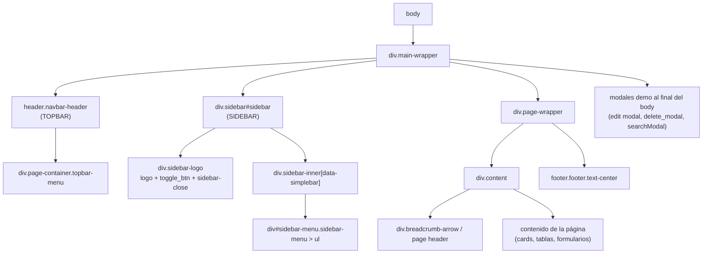

# Análisis del Template **Dreams EMR**

> **Fecha:** 2026-09-12
> **Alcance:** Análisis técnico y visual del template `Dreams EMR` (carpeta `c:\laragon\www\dreamsemr`) como base de interfaz de **Clínica UroCenter**.
> **Documento relacionado:** `../Arquitectura del Sistema Web Clínica UroCenter.md` (doc 01, §5 *Plantilla Base*).
> **Objetivo:** Documentar la estructura real del template, sus assets, sus componentes y el plan de conversión a Blade + Laravel 12, antes de escribir código.

---

## Índice

1. [Identidad de la plantilla](#1-identidad-de-la-plantilla)
2. [Inventario de assets](#2-inventario-de-assets)
3. [Anatomía del layout HTML](#3-anatomía-del-layout-html)
4. [Sidebar (menú lateral)](#4-sidebar-menú-lateral)
5. [Topbar](#5-topbar)
6. [Footer](#6-footer)
7. [Theming y variantes de layout](#7-theming-y-variantes-de-layout)
8. [Componentes y librerías disponibles](#8-componentes-y-librerías-disponibles)
9. [Inventario de páginas y mapeo a UroCenter](#9-inventario-de-páginas-y-mapeo-a-urocenter)
10. [Brechas: pantallas que el template NO trae](#10-brechas-pantallas-que-el-template-no-trae)
11. [Plan de conversión a Blade](#11-plan-de-conversión-a-blade)
12. [Riesgos, limitaciones y recomendaciones](#12-riesgos-limitaciones-y-recomendaciones)
- [Anexo A. Inventario de archivos](#anexo-a-inventario-de-archivos)
- [Anexo B. Archivos fuente leídos](#anexo-b-archivos-fuente-leídos)

---

## 1. Identidad de la plantilla

| Ítem | Valor |
|---|---|
| Nombre | **Dreams EMR — Responsive Bootstrap 5 Medical Admin Template** |
| Autor | **Dreams Technologies** (`dreamstechnologies`) |
| Distribución | ThemeForest (`themeforest.net/user/dreamstechnologies`) |
| Tipo | Template **HTML estático** (no incluye aplicación funcional) |
| Base CSS | **Bootstrap 5** (`assets/css/bootstrap.min.css`, + variante `bootstrap.rtl.min.css`) |
| CSS propio | `assets/css/style.css` (+ `style.css.map`) y fuentes SCSS en `assets/scss/` |
| Iconografía | **Tabler Icons** (`<i class="ti ti-*">`), + FontAwesome, Material, Remix, Feather, Ionic, SimpleLine, Themify, Weather, Typicon, Flags |
| JavaScript | **JS nativo (sin jQuery)** — ver §2.3 |
| Build system | **No tiene** (`package.json` inexistente, no hay `node_modules`, no hay `dist`) |
| Páginas HTML | **152** archivos `.html` en `html/` |
| Plugins | **25** familias en `html/assets/plugins/` |
| Idiomas | Textos en **inglés** (incluye selector de idioma decorativo: `us`, `de`, `fr`, `ae`) |
| Assets de imagen | `logo.svg`, `logo-dark.svg`, `logo-small.svg`, `favicon.png`, `apple-icon.png`, carpetas `avatars/`, `profiles/`, `doctors/`, `users/`, `flags/`, `bg/`, `icons/`, `media/`, `theme/`, `calls/`, `chat/`, `emojis/`, `error/`, `gallery/`, `social/` |
| Documentación | `documentation/` (HTML del vendor: `index.html`, `html.html`, `laravel.html`, `angular.html`, `react.html`, `vue.html`, `nextjs.html`, `changelog.html`) |

### 1.1 Qué es y qué no es

- **Sí es:** un conjunto de 152 páginas maquetadas con el layout completo ya resuelto (sidebar, topbar, cards, tablas, formularios, calendario, modales), más los assets de terceros listos para servir desde `public/`.
- **No es:** un proyecto Laravel, ni un starter kit, ni contiene lógica de negocio. El archivo `documentation/laravel.html` es **documentación genérica del vendor**, no código de integración.
- **Consecuencia directa:** la conversión a Blade es **manual**; no existe un `Resources/views` de origen que copiar (§11).

---

## 2. Inventario de assets

### 2.1 Carpetas de `html/assets/`

| Carpeta | Contenido | Uso |
|---|---|---|
| `css/` | 7 archivos: `bootstrap.min.css`, `bootstrap.min.css.map`, `bootstrap.rtl.min.css`, `bootstrap.rtl.min.css.map`, `bootstrap-datetimepicker.min.css`, `style.css`, `style.css.map` | CSS del tema |
| `js/` | 16 archivos (ver §2.2) | Scripts del tema |
| `plugins/` | **25** familias de librerías de terceros | Plugins por página |
| `img/` | Logos, favicons, avatares, banderas, imágenes demo | Assets estáticos |
| `scss/` | `main.scss`, `_variables.scss`, `components/`, `pages/`, `plugins/`, `structure/`, `utils/` | **Fuente SCSS** (compilada en `style.css`) |

### 2.2 Archivos JavaScript del tema (`html/assets/js/`)

| Archivo | Rol |
|---|---|
| `theme-script.js` | Configuración de tema (dark, layout, colores, sidebar) — se carga en `<head>` **antes del CSS** |
| `script.js` | Núcleo del tema: sidebar, toggles, fullscreen, animaciones, dark mode, notificaciones |
| `bootstrap.bundle.min.js` | Bootstrap 5 + Popper |
| `datatable-vanilla.js` | **DataTable propio del tema** (vanilla) para `table.datatable` |
| `daterangepicker-vanilla.js` | Date range picker vanilla |
| `sweetalerts.js` | Helpers de SweetAlert2 |
| `form-quill.js`, `form-fileupload.js`, `form-wizard.js` | Inicializadores de formularios |
| `range-slider.js`, `dragula.js`, `clipboard.js`, `chat.js`, `coming-soon.js` | Inicializadores específicos |
| `bootstrap-datetimepicker.min.js` | Date/time picker (junto al CSS homónimo) |
| `bootstrap.bundle.min.js.map` | Source map |

### 2.3 Confirmación: **el template NO usa jQuery**

Se verificó por búsqueda en los 152 HTML: **cero** referencias a `jquery`. El archivo `script.js` es una reimplementación en JavaScript nativo de los helpers tipo jQuery (animaciones `slideUp`/`slideDown`, `stop`, medición de viewport), con comentarios que mencionan el comportamiento original de jQuery pero sin dependencia real.

> **Impacto sobre el doc 01:** el doc 01 §4 lista *"JavaScript / jQuery"*. Se recomienda ajustar ese punto a **JavaScript nativo (vanilla)**, porque ni el template ni el proyecto de referencia (FlowStock) usan jQuery. Ver §12.

### 2.4 Orden de carga de assets (patrón por página)

En `<head>`, el orden es relevante:

1. `<meta charset>` + viewport + favicon/apple-icon.
2. **`assets/js/theme-script.js`** → debe ir **antes** del CSS para aplicar tema/layout sin parpadeo (evita FOUC).
3. `assets/css/bootstrap.min.css`.
4. CSS de plugins necesarios (`flatpickr`, `choices.js`, `tabler-icons`, `simplebar`, `datatables`, etc.).
5. `assets/css/style.css` con `id="app-style"` (permite cambiar de tema dinámicamente).

Al final del `<body>`:

1. `assets/js/bootstrap.bundle.min.js`.
2. `assets/plugins/simplebar/simplebar.min.js`.
3. Scripts de plugins de la página (ej. `assets/js/datatable-vanilla.js` en `data-tables.html`).
4. `assets/js/script.js` (**siempre el último**).

### 2.5 Librerías de terceros (`html/assets/plugins/`)

`apexchart`, `c3-chart`, `chartjs`, `choices.js`, `clipboard`, `datatables`, `dragula`, `dropzone`, `flatpickr`, `fontawesome`, `fullcalendar`, `icons`, `inputmask`, `lightbox`, `material`, `nouislider`, `quill`, `simplebar`, `simpleline`, `sweetalert2`, `swiper`, `tabler-icons`, `theia-sticky-sidebar`, `vanilla-wizard`, `wnumb`.

Equivalentes funcionales relevantes para el proyecto:

| Necesidad | Plugin disponible |
|---|---|
| Tablas de datos | `datatables` (CSS) + `assets/js/datatable-vanilla.js` (JS del tema) |
| Confirmaciones / alertas | `sweetalert2` (+ `assets/js/sweetalerts.js`) |
| Fechas | `flatpickr`, `assets/js/bootstrap-datetimepicker.min.js` |
| Selects con búsqueda | `choices.js` |
| Editor enriquecido | `quill` |
| Subida de archivos | `dropzone`, `form-fileupload.js` |
| Asistentes multi-paso | `vanilla-wizard`, `form-wizard.js` |
| Calendario / agenda | `fullcalendar` |
| Gráficos | `apexchart`, `chartjs`, `c3-chart` |
| Scroll fino en sidebar | `simplebar` |

> **Nota:** el DataTable del tema (`datatable-vanilla.js`) está escrito para tablas con la clase `.datatable` y **replica la estructura DOM del plugin jQuery DataTables** (`.dataTables_wrapper`, `.dataTables_filter`, `.dataTables_length`, `.dataTables_info`, `.dataTables_paginate`, clases `sorting`/`sorting_asc`/`sorting_desc`) para que las reglas ya existentes en `style.css` se apliquen sin cambios. Es decir: **no requiere jQuery** y las filas se pueden seguir inyectando desde Laravel.

---

## 3. Anatomía del layout HTML

### 3.1 Estructura general (confirmada en `html/index.html`)



### 3.2 Orden real de bloques dentro del `<body>`

1. `<div class="main-wrapper">` (contenedor raíz de todo).
2. `<header class="navbar-header">` → topbar.
3. `<div class="sidebar" id="sidebar">` → menú lateral.
4. `<div class="page-wrapper">` → `<div class="content">` → breadcrumb + contenido.
5. `<footer class="footer text-center">` → `2026 © Dreams EMR` (línea 1587 de `index.html`).
6. Modales demo (`edit Modal`, `delete_modal`, `#searchModal`) y **después** los `<script>`.

### 3.3 Implicancias para Blade

| Bloque HTML | Destino en Blade |
|---|---|
| `html > head` (meta, css, theme-script) | `resources/views/layouts/app.blade.php` (head) |
| `header.navbar-header` | `resources/views/components/layouts/topbar.blade.php` |
| `div.sidebar#sidebar` | `resources/views/components/layouts/sidebar.blade.php` |
| `div.page-wrapper > div.content` | `@yield('content')` dentro del layout |
| `footer.footer` | `resources/views/components/layouts/footer.blade.php` |
| `script` finales | bloque del layout + `@stack('scripts')` |
| CSS de página | `@stack('styles')` |
| Modales de página | dentro de cada vista hija (no en el layout) |

> **Problema estructural:** el layout está **duplicado en las 152 páginas**. No hay partials ni `@@include`. Cada conversión debe extraer el layout una sola vez y luego recortar el contenido de cada HTML.

---

## 4. Sidebar (menú lateral)

### 4.1 Marcado

```html
<div class="sidebar" id="sidebar">
  <div class="sidebar-logo"> … logo + toggle_btn + sidebar-close … </div>
  <div class="sidebar-inner" data-simplebar>
    <div id="sidebar-menu" class="sidebar-menu">
      <ul role="menu" aria-label="Main navigation menu">
        <li class="menu-title" aria-disabled="true"><span>MAIN</span></li>
        <li><a href="index.html" class="active"><i class="ti ti-layout-board"></i><span>Dashboard</span></a></li>
        <li class="submenu">
          <a href="javascript:void(0);"><i class="ti ti-apps"></i><span>Applications</span><span class="menu-arrow"></span></a>
          <ul>
            <li><a href="chat.html">Chat</a></li>
            <li class="submenu submenu-two">
              <a href="#">Calls<span class="menu-arrow inside-submenu"></span></a>
              <ul><li><a href="voice-call.html">Voice Call</a></li></ul>
            </li>
          </ul>
        </li>
      </ul>
    </div>
  </div>
</div>
```

### 4.2 Jerarquía de clases del menú

| Nivel | Marcado | Significado |
|---|---|---|
| Separador de sección | `<li class="menu-title">` | Título de bloque (MAIN, HEALTHCARE, MANAGE, PAGES, UI Interface, HELP) |
| Nivel 1 (ítem simple) | `<li><a href>…</a></li>` | Enlace directo |
| Nivel 1 (con hijos) | `<li class="submenu"><a>…<span class="menu-arrow"></span></a><ul>…</ul></li>` | Desplegable |
| Nivel 2 | `<li><a href>…</a></li>` dentro del `<ul>` del `submenu` | Enlace hijo |
| Nivel 3 | `<li class="submenu submenu-two"><a>…<span class="menu-arrow inside-submenu"></span></a><ul>…</ul></li>` | Sub-desplegable |
| Nivel 4 (soporte extra) | `class="submenu submenu-two submenu-three"` con `inside-submenu-two` | La plantilla demo lo soporta |
| Ítem activo | `class="active"` en el `<a>` | Página actual |

### 4.3 Mapeo a menú dinámico desde base de datos

Reutilizando el modelo de menús de FlowStock (documentado en `analisis-arquitectura-flowstock.md` §10 y §12), el mapeo es directo:

| Tabla `menu` (FlowStock) | Markup Dreams EMR |
|---|---|
| `bloque` (`CLINICO`, `COMERCIAL`, `ADMIN`, `REPORTES`) | `<li class="menu-title"><span>{{ $bloque }}</span></li>` |
| `nivel` = `01` (raíz de bloque) | Se omite como ítem; solo aporta el título del bloque |
| `nivel` = `02` con hijos | `<li class="submenu">` + `<span class="menu-arrow">` |
| `nivel` = `0201` (hoja) | `<li><a href="{{ route($enlace) }}">` |
| `icono` (`ti ti-*` o `solar:*`) | `<i class="ti ti-…">` (recomendado) o `<iconify-icon icon="…">` |
| `enlace` (nombre de ruta Laravel) | `route($enlace)` + `request()->routeIs($enlace) ? 'active' : ''` |
| `orden` | Orden de iteración |
| `estado = false` | No se renderiza |

Estructura Blade equivalente por nivel:

```text
@foreach($menuTree as $raiz)
    @if($raiz['bloque'])      <li class="menu-title"><span>{{ $raiz['bloque'] }}</span></li> @endif
    @if(count($raiz['hijos']))<li class="submenu"> … @foreach($raiz['hijos'] as $hijo) … @endforeach … </li>
    @else                     <li><a class="…active…" href="…"> … </a></li>
    @endif
@endforeach
```

- El nivel 3 se resuelve con un segundo `@foreach` y `class="submenu submenu-two"`.
- La clase `active` se calcula con `request()->routeIs($enlace)`.
- La expansión del submenú activo se resuelve marcando `active` en el ancestro o con el JS del tema.

> **Decisión pendiente (ver §12):** iconos Tabler directos (`<i class="ti ti-x">`) vs mantener `iconify` (que soporta `solar:*` y `tabler:*`). Elegir antes de sembrar el `MenuSeeder` de UroCenter, porque define el valor guardado en `menu.icono`.

---

## 5. Topbar

`<header class="navbar-header">` → `<div class="page-container topbar-menu">`. Bloques identificados:

| # | Bloque | Elementos clave | Nota para UroCenter |
|---|---|---|---|
| 1 | Botón sidebar móvil | `<a id="mobile_btn" class="mobile-btn" href="#sidebar">` + `<i class="ti ti-menu-deep">` | Se mantiene igual |
| 2 | Logo | `.logo` con `logo-light` / `logo-dark` / `logo-small` (`assets/img/logo*.svg`) | Reemplazar por logo de la clínica |
| 3 | Toggle de sidebar | `<button id="toggle_btn2">` + `ti ti-arrow-bar-to-right` | Se mantiene |
| 4 | Buscador desktop | `.header-search` con `input.form-control` + `input-icon-addon` | Actualmente **no funcional** (sin ruta) |
| 5 | Buscador móvil | `.d-lg-none` + `data-bs-target="#searchModal"` | Requiere el `#searchModal` |
| 6 | Pantalla completa | `.btnFullscreen` + `ti ti-minimize` | Lo maneja `script.js` |
| 7 | Selector de idioma | Dropdown con `assets/img/flags/*.svg` (us, de, fr, ae) | **Decorativo**; reemplazar por locale `es` o eliminar |
| 8 | Notificaciones | `ti ti-bell-check`, `.notification-badge`, `.notification-body[data-simplebar]`, 4 ítems demo con `data-dismissible="#notification-N"`, footer *View All Notifications* | Debe conectarse a datos reales después |
| 9 | Modo claro/oscuro | `<button id="light-dark-mode">` + `ti ti-moon` | Lo maneja `script.js` + `theme-script.js` |
| 10 | Menú de usuario | Avatar (`avatar-31.jpg`), `.online`, nombre **Jimmy Anderson**, rol **Administrator**, ítems *Profile Settings*, *Notifications*, *Help & Support*, *Settings*, *Sign Out* | Mapear a `session('usuario_display_name')` y `session('usuario_perfil_nombre')` (patrón FlowStock) y logout por `POST` + `@csrf` |

---

## 6. Footer

```html
<footer class="footer text-center">
  <p class="mb-0 text-dark">2026 &copy; <a href="javascript:void(0);" class="link-primary">Dreams EMR</a> - All Rights Reserved.</p>
</footer>
```

Sustituir por `© <año> Clínica UroCenter`. En FlowStock el equivalente es `resources/views/components/layouts/footer.blade.php`.

---

## 7. Theming y variantes de layout

### 7.1 Atributos en `<html>`

`theme-script.js` lee los atributos del elemento `<html>` y los persiste en `sessionStorage` bajo la clave **`__THEME_CONFIG__`** (`window.config` / `window.defaultConfig` quedan expuestos globalmente).

| Atributo | Valores | Efecto |
|---|---|---|
| `data-bs-theme` | `light` / `dark` | Tema claro/oscuro de Bootstrap |
| `data-layout` | `fluid`, `mini`, `hidden`, `fullwidth`, … | Modo de layout y tamaño del sidebar |
| `data-color` | `primary`, … | Color de acento |
| `data-topbar` | `white`, … | Color del topbar |
| `data-sidebar` | `light`, `dark`, … | Color del menú |
| `data-sidenav-user` | `true` / `false` | Bloque de usuario dentro del sidebar |

### 7.2 Páginas de variantes incluidas

`layout-dark.html`, `layout-rtl.html`, `layout-mini.html`, `layout-hidden.html`, `layout-hoverview.html`, `layout-fullwidth.html`.

### 7.3 Riesgo / comportamiento a preservar en Blade

- `theme-script.js` se carga **en el `<head>` antes del CSS** con el objetivo de evitar el "flash" de tema incorrecto (FOUC) al recargar en modo oscuro. Debe mantenerse **inline o como primer script del head**, sin `defer`.
- Usa `sessionStorage` (no cookie), por lo que **no rompe el caché HTTP** ni viaja al servidor: es seguro con Blade/SSR.
- El botón `#light-dark-mode` y `data-bs-theme` deben seguir existiendo en el layout convertido para que `script.js` no falle.

---

## 8. Componentes y librerías disponibles

| Necesidad funcional UroCenter | Página de referencia | Plugin / script |
|---|---|---|
| Dashboard con KPIs | `index.html`, `widgets.html` | `apexchart`, `chartjs` |
| Listado con filtro y paginación | `data-tables.html` | `datatables` + `datatable-vanilla.js` |
| Tablas simples | `tables-basic.html` | — |
| Confirmaciones / mensajes | `ui-sweetalerts.html` | `sweetalert2` + `sweetalerts.js` |
| Modales CRUD | `ui-modals.html` | Bootstrap 5 |
| Formulario con validación | `form-validation.html`, `form-basic-inputs.html` | Bootstrap 5 |
| Selects con búsqueda (paciente, médico) | `form-select.html` | `choices.js` |
| Fechas y horas (citas) | `form-pickers.html` | `flatpickr`, `bootstrap-datetimepicker` |
| Editor de texto (evolución clínica) | `form-editors.html` | `quill` |
| Subida de archivos (laboratorio, documentos) | `form-fileupload.html` | `dropzone` + `form-fileupload.js` |
| Formulario multi-paso (admisión, triaje) | `form-wizard.html` | `vanilla-wizard` + `form-wizard.js` |
| Calendario / agenda médica | `calendar.html`, `appointment-calendar.html` | `fullcalendar` |
| Chat interno / mensajería | `chat.html`, `messages.html` | `chat.js` |
| Kanban (flujo de atenciones) | `kanban-view.html` | `dragula` |
| Gráficos de reportes | `chart-apex.html`, `chart-js.html`, `chart-c3.html` | 3 librerías |
| Impresión de comprobante | `invoice.html`, `invoice-details.html` | CSS de impresión del tema |
| Perfil / ajustes | `general-settings.html`, `security-settings.html` | — |

---

## 9. Inventario de páginas y mapeo a UroCenter

### 9.1 Agrupación de las 152 páginas

| Grupo | Cantidad aprox. | Ejemplos |
|---|---|---|
| Dashboard / widgets | 3 | `index.html`, `widgets.html`, `starter-page.html` |
| Clínico (pacientes, médicos, citas, visitas, laboratorio, farmacia) | 30 | `patients.html`, `patient-details.html`, `doctors.html`, `appointments.html`, `visits.html`, `lab-results.html`, `pharmacy.html` |
| Facturación / comercial | 11 | `invoice.html`, `add-invoice.html`, `manage-invoices.html`, `transactions.html`, `transaction-details.html` |
| Aplicaciones | 15 | `chat.html`, `email.html`, `contacts.html`, `todo.html`, `notes.html`, `kanban-view.html`, `file-manager.html` |
| Configuración / settings | 10 | `general-settings.html`, `permission-settings.html`, `user-permissions-settings.html`, `security-settings.html` |
| Autenticación y errores | 9 | `login.html`, `sign-up.html`, `forgot-password.html`, `lock-screen.html`, `change-password.html`, `error-404.html`, `error-500.html`, `coming-soon.html`, `under-maintenance.html` |
| UI base y avanzada (`ui-*`) | ~35 | `ui-accordion.html`, `ui-alerts.html`, `ui-cards.html`, `ui-modals.html`, `ui-nav-tabs.html` |
| Formularios (`form-*`) | 14 | `form-basic-inputs.html`, `form-wizard.html`, `form-editors.html`, `form-select.html` |
| Tablas | 2 | `tables-basic.html`, `data-tables.html` |
| Gráficos (`chart-*`) | 3 | `chart-apex.html`, `chart-c3.html`, `chart-js.html` |
| Iconos (`icon-*`) | 13 | `icon-tabler.html`, `icon-fontawesome.html`, … |
| Variantes de layout | 6 | `layout-dark.html`, `layout-rtl.html`, `layout-mini.html`, … |
| Legales / otros | 5 | `privacy-policy.html`, `terms-and-conditions.html`, `notifications.html`, `search-result.html`, `social-feed.html` |

### 9.2 Mapeo **pantalla Dreams EMR → módulo UroCenter** (doc 01)

#### Área CLÍNICO

| Módulo UroCenter | Pantalla(s) del template | Uso previsto |
|---|---|---|
| Pacientes | `patients.html`, `all-patients-list.html`, `add-patient.html`, `edit-patient.html`, `patient-search.html` | CRUD + buscador de paciente |
| Historia Clínica | `patient-details.html` + pestañas: `patient-details-medical-history.html`, `patient-details-vital-signs.html`, `patient-details-prescription.html`, `patient-details-lab-results.html`, `patient-details-visit-history.html`, `patient-details-appointments.html`, `patient-details-documents.html`, `patient-details-billings.html`, `patient-details-insurance.html` | Ficha del paciente con pestañas = estructura natural de la HC |
| Admisión | (`form-wizard.html`, `add-patient.html` como base) | Formulario multi-paso de admisión |
| Citas | `appointments.html`, `appointment-calendar.html`, `calendar.html`, `requests.html` | Agenda + solicitudes de cita |
| Consulta Externa | `appointment-consultation.html` | Pantalla de consulta |
| Atención / Visitas | `visits.html`, `start-visits.html` | Inicio de atención (entidad transversal ATENCION, doc 01 §38) |
| Tópico | *(sin equivalente directo)* → usar `appointment-consultation.html` como base | — |
| Procedimientos | `medical-results.html` | Maestro + procedimiento realizado |
| Laboratorio / Resultados | `lab-results.html`, `medical-results.html` | Resultados de laboratorio y estudios |
| Médicos | `doctors.html`, `add-doctors.html`, `edit-doctors.html`, `doctor-details.html`, `all-doctors-list.html` | CRUD de médicos |
| Personal | `staffs.html` | CRUD de personal |
| Especialidades / Consultorios | `permission-settings.html` / `general-settings.html` como base de maestros | Construir con `data-tables.html` |
| CIE-10 / Controles | `data-tables.html` | Maestro de diagnósticos y controles |

#### Área COMERCIAL / FARMACIA

| Módulo UroCenter | Pantalla(s) del template | Uso previsto |
|---|---|---|
| POS | `invoice.html`, `add-invoice.html`, `ecommerce`-like: `manage-add-invoices.html` | Venta rápida tipo factura (ver §10: no hay POS de teclado/lector) |
| Ventas | `manage-invoices.html`, `manage-invoices-details.html`, `invoice-details.html` | Listado y detalle de ventas |
| Facturación | `edit-invoice.html`, `manage-edit-invoices.html`, `invoice-details.html` | Comprobantes (boleta/factura/ticket) |
| Caja | `transactions.html`, `transaction-details.html` | Movimientos de caja y arqueo |
| Farmacia | `pharmacy.html` | Inventario de farmacia y dispensación |
| Inventario / Almacén | *(sin equivalente)* → `data-tables.html` + `form-*` | Ver §10 |

#### Área ADMIN y REPORTES

| Módulo UroCenter | Pantalla(s) del template | Uso previsto |
|---|---|---|
| Usuarios | `user-permissions-settings.html`, `general-settings.html` | CRUD de usuarios |
| Roles (Perfiles) | `permission-settings.html` | Perfiles + matriz de permisos |
| Permisos | `permission-settings.html`, `user-permissions-settings.html` | Maestro de acciones |
| Menús | `permission-settings.html` (árbol) | Árbol jerárquico de menús |
| Configuración | `general-settings.html`, `appearance-settings.html`, `preferences-settings.html`, `notifications-settings.html`, `plans-billings-settings.html`, `security-settings.html` | Configuración estructural + parámetros |
| Reportes | `chart-apex.html`, `chart-c3.html`, `chart-js.html`, `widgets.html` | Dashboards y reportes (bloque REPORTES, 3er nivel de menú) |
| Autenticación | `login.html`, `sign-up.html`, `forgot-password.html`, `change-password.html`, `lock-screen.html` | Base de `auth/login.blade.php` y `auth/register.blade.php` |
| Errores | `error-404.html`, `error-500.html`, `under-maintenance.html`, `coming-soon.html` | Vistas `errors/404.blade.php`, `errors/500.blade.php`, mantenimiento |

---

## 10. Brechas: pantallas que el template NO trae

Estas pantallas **no existen** en Dreams EMR y deben construirse combinando los componentes del propio tema:

| Brecha | Estrategia propuesta |
|---|---|
| **POS de venta rápida** (teclado, lector de barras, ticket 58/80 mm) | Componer con `manage-add-invoices.html` + `form-select.html` (choices.js) + una hoja de estilo de impresión para ticket |
| **Inventario / Almacén** (kardex, stock, transferencias) | `data-tables.html` para listados + `form-wizard.html` para movimientos |
| **Compras** (órdenes de compra, registro de compras) | `form-wizard.html` + `data-tables.html` |
| **Caja chica** (apertura, cierre, arqueo) | `transactions.html` + modales |
| **Admisión** como entidad propia | `form-wizard.html` |
| **Tópico / triaje** | `appointment-consultation.html` adaptado |
| **Series y correlativos de comprobantes** | `data-tables.html` |
| **CIE-10** (maestro de diagnósticos) | `data-tables.html` con búsqueda |
| **Historia clínica con formato peruano** (SOAP, HIS) | Pestañas de `patient-details.html` |
| **Consentimientos informados** | `form-editors.html` (quill) + impresión |
| **Reportes médicos específicos** | `chart-js.html` / `chart-apex.html` |

---

## 11. Plan de conversión a Blade

### 11.1 Decisión de integración (aprobada)

> **Copiar los assets del template a `public/assets/` y recrear los layouts como Blade propios.**
> Es el mismo patrón ya probado en FlowStock, que copió `dist/assets/` del tema *Silvar* a `public/assets/`.

| Aspecto | Decisión |
|---|---|
| Assets | `dreamsemr/html/assets/**` → `clinicaurocenter/public/assets/**` |
| CSS | Servir `assets/css/bootstrap.min.css`, `assets/css/style.css`, `assets/plugins/**` con `asset()` |
| JS de página | Cargar por vista con `@push('scripts')` (no todo en el layout) |
| Vite | Solo para JS propio del proyecto (`resources/js/urocenter.js`); **sin Tailwind** |
| SCSS | No recompilar en la primera fase; usar `style.css` + un CSS propio de overrides |
| jQuery | **No se usa** (ni el template ni FlowStock lo requieren) |

### 11.2 Árbol de vistas objetivo

```text
resources/views/
├── layouts/
│   ├── app.blade.php                 @extends base del panel (topbar + sidebar + content + footer)
│   └── guest.blade.php               login / register / recuperar contraseña
├── components/layouts/
│   ├── sidebar.blade.php             menú dinámico desde session('usuario_menu_tree')
│   ├── topbar.blade.php              usuario real de sesión + dark mode + notificaciones
│   └── footer.blade.php              © año Clínica UroCenter
├── components/errors/                error-404, error-500, under-maintenance, coming-soon
├── auth/                             login, register, forgot-password, change-password
├── clinico/<modulo>/index.blade.php  pacientes, citas, consulta, medicos, personal, …
├── comercial/<modulo>/index.blade.php
├── admin/<modulo>/index.blade.php
└── reportes/<modulo>/index.blade.php
```

### 11.3 Reglas de limpieza al convertir un `.html` a `.blade.php`

| En el HTML del template | En Blade |
|---|---|
| `assets/…` | `{{ asset('assets/…') }}` |
| `href="patients.html"` | `href="{{ route('clinico.pacientes.index') }}"` |
| `class="active"` fijo | `{{ request()->routeIs('…') ? 'active' : '' }}` |
| `<span>MAIN</span>` (menu-title) | `{{ $bloque }}` desde `menu.bloque` |
| Bloques de layout (topbar/sidebar/footer) | `@include` / `@yield` |
| Datos demo (Avatars `avatar-31.jpg`, *Jimmy Anderson*, *Administrator*, fechas 2024) | Variables de sesión / datos reales |
| Ítems demo del menú (Pages, UI Interface, HELP, Documentation, Changelog) | Menú real de UroCenter sembrado en BD |
| Selector de idioma (us/de/fr/ae) | Eliminar o fijar `es` |
| Textos en inglés | Traducir a español |
| `2026 © Dreams EMR` | `© {{ date('Y') }} Clínica UroCenter` |
| Modales demo (`edit Modal`, `delete_modal`) | Modales reales por módulo (crear/editar/ver) |
| `onclick="…"` inline del demo | Handlers con `fetch` + `@csrf` (patrón FlowStock) |
| Scripts al final | `@push('scripts')` en la vista |

### 11.4 Orden de conversión sugerido

| Fase | Entregable | Criterio de aceptación |
|---|---|---|
| 0 | Copia de `assets/` a `public/assets/` | `index.html` del template se ve igual servido desde Laravel |
| 1 | `layouts/app.blade.php` + `topbar` + `sidebar` (estático primero) | El layout replica píxel a píxel `index.html` sin secciones de contenido |
| 2 | Sidebar dinámico desde `usuario_menu_tree` + `@can_do` | El menú cambia según el perfil del usuario logueado |
| 3 | `layouts/guest.blade.php` + `auth/login.blade.php` | Login funcional con el tema aplicado |
| 4 | Vistas de error y páginas utilitarias | 404/500/mantenimiento con estilos del tema |
| 5 | Página piloto de listado CRUD (`data-tables.html`) | Listado con AJAX + modal + sweetalert + `@can_do` |
| 6 | Página piloto maestro-detalle (`form-wizard.html`) | Formulario multi-paso guardando en BD |

### 11.5 Reglas de rendimiento

- Cargar en el layout **solo**: `bootstrap.bundle.min.js`, `simplebar`, `script.js`, `theme-script.js` (head) y el JS propio del proyecto.
- Todo plugin adicional (`fullcalendar`, `quill`, `choices.js`, `dropzone`, `apexchart`, `flatpickr`, `sweetalert2`, `datatables`) se carga **por vista** con `@push('scripts')`.
- No copiar a `public/` las imágenes demo que no se usen (avatares, galería, social) — reduce peso del repo.

---

## 12. Riesgos, limitaciones y recomendaciones

| # | Riesgo / limitación | Impacto | Recomendación |
|---|---|---|---|
| R1 | **152 HTML con el layout duplicado** | Conversión manual, propensa a inconsistencias | Extraer layout una sola vez; luego convertir página por página con una checklist |
| R2 | **CSS compilado** (`style.css` + `.map`), SCSS fuente incluido | Personalizar colores/marca requiere recompilar o sobrescribir | Fase 1: `public/assets/css/urocenter.css` con overrides. Fase 2 (opcional): portar `assets/scss` a un build Vite + `sass` |
| R3 | **Doc 01 menciona jQuery** | Contradice template y FlowStock (ambos vanilla) | Actualizar doc 01 §4 a "JavaScript nativo"; el doc 01 §4.1 prohíbe Livewire, no jQuery, pero no se usará |
| R4 | **DataTables distinta a FlowStock** (tema: `datatable-vanilla.js`; FlowStock: `vanilla-datatables`) | Dos enfoques de tabla en el proyecto | Elegir uno (§12.1) |
| R5 | **Iconografía distinta** (tema: Tabler; FlowStock: `iconify` + `solar:*`) | Define el contenido de `menu.icono` | Elegir uno (§12.2) |
| R6 | **Textos en inglés y datos demo** (nombres, avatares, notificaciones, `notification-badge`) | Ruido visual y riesgo de dejar datos ficticios | Limpiar en la conversión (§11.3); revisar antes de cada commit |
| R7 | **25 familias de plugins** | Peso y conflictos si se cargan globalmente | Carga por página (§11.5) |
| R8 | **Sin build system** | No hay pipeline para SCSS ni minificación propia | Vite solo para JS/CSS propio |
| R9 | **Licencia comercial (ThemeForest)** | No se puede redistribuir el template | Mantener `assets/` dentro del proyecto privado; no publicar el repo como plantilla |
| R10 | **Menú demo enorme** (Pages, UI Interface, HELP, multinivel de ejemplo) | No debe llegar al usuario final | Reemplazar por el `MenuSeeder` real de UroCenter |
| R11 | **Selector de idioma decorativo** | Confunde (no traduce nada) | Eliminar o cablear a `APP_LOCALE` |
| R12 | **`theme-script.js` en el head** depende de atributos en `<html>` | Si se elimina, se pierde dark mode y se produce FOUC | Conservar el script y los atributos `data-*` en el layout |

### 12.1 Decisión pendiente — librería de tablas

| Opción | Ventajas | Desventajas |
|---|---|---|
| **A. `datatable-vanilla.js` de Dreams EMR** (recomendada) | Coherencia visual total (el CSS del tema ya espera su DOM), sin dependencia extra, sin jQuery | Menos features (filtro/sort/paginación); editable y simple de extender |
| B. `vanilla-datatables` (como FlowStock) | Ya probado con `getData` + `can` y con modales de FlowStock | El markup/clases no son los del tema; requiere CSS extra |
| C. `simple-datatables` | Librería madura con más features | Suma otro paquete y otro CSS |

> Con las tres opciones el backend es idéntico: endpoint `GET …/data` que devuelve `{ data, can }`. La decisión es **solo de renderizado**.

### 12.2 Decisión pendiente — iconos

| Opción | Ventajas | Desventajas |
|---|---|---|
| **A. Tabler directo `<i class="ti ti-*">`** (recomendada) | Nativo del tema, sin JS extra, menos peso | `menu.icono` guarda valores `ti ti-*`; si algún día se cambia de tema hay que migrar las filas |
| B. Mantener `iconify` (`tabler:*`, `solar:*`) | Flexibilidad: se cambia el icono sin tocar el HTML; compatible con lo ya sembrado en FlowStock | Carga una dependencia JS adicional (`iconify-icon`) |

---

## Anexo A. Inventario de archivos

```
c:\laragon\www\dreamsemr\
├── documentation/                     docs del vendor (HTML estático)
│   ├── index.html  html.html  laravel.html  angular.html  react.html
│   ├── vue.html    nextjs.html  changelog.html
│   └── assets/{css,fonts,img,js,plugins}
└── html/                              152 páginas + assets
    ├── *.html                         (152 archivos)
    └── assets/
        ├── css/                       7 archivos
        ├── js/                        16 archivos
        ├── img/                       logos, avatars/, profiles/, doctors/, users/,
        │                              flags/, bg/, icons/, media/, theme/, calls/,
        │                              chat/, emojis/, error/, gallery/, social/
        ├── scss/                      main.scss, _variables.scss,
        │                              components/, pages/, plugins/, structure/, utils/
        └── plugins/                   25 carpetas
```

---

## Anexo B. Archivos fuente leídos

| Archivo | Qué se obtuvo |
|---|---|
| `html/index.html` | Layout completo (head, topbar, sidebar, content, footer, modales, scripts), bloques del menú |
| `html/data-tables.html` | Uso del DataTable del tema (`table.datatable` + `datatable-vanilla.js`) |
| `html/assets/js/script.js` | Confirmación de JS nativo (sin jQuery) |
| `html/assets/js/theme-script.js` | Atributos `data-*` de theming y `sessionStorage.__THEME_CONFIG__` |
| `html/assets/js/datatable-vanilla.js` | API del DataTable del tema (búsqueda, orden, paginación, filas) |
| `html/assets/css/` | Listado de CSS disponibles |
| `html/assets/plugins/` | 25 familias de librerías |
| `documentation/laravel.html` | Confirmación: documentación genérica del vendor, no proyecto Laravel |
| `../Arquitectura del Sistema Web Clínica UroCenter.md` | Módulos objetivo, stack, restricción "sin Livewire" (§3, §4, §5, §32–§37) |

---

*Fin del documento. Cualquier cambio de arquitectura de interfaz debe actualizarse aquí antes de implementarse (doc 01 §49).*
